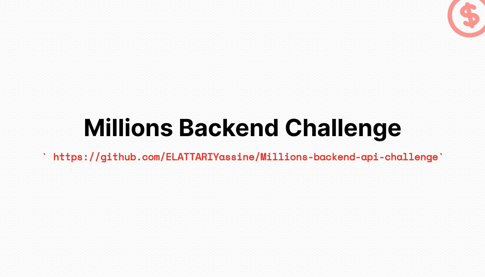
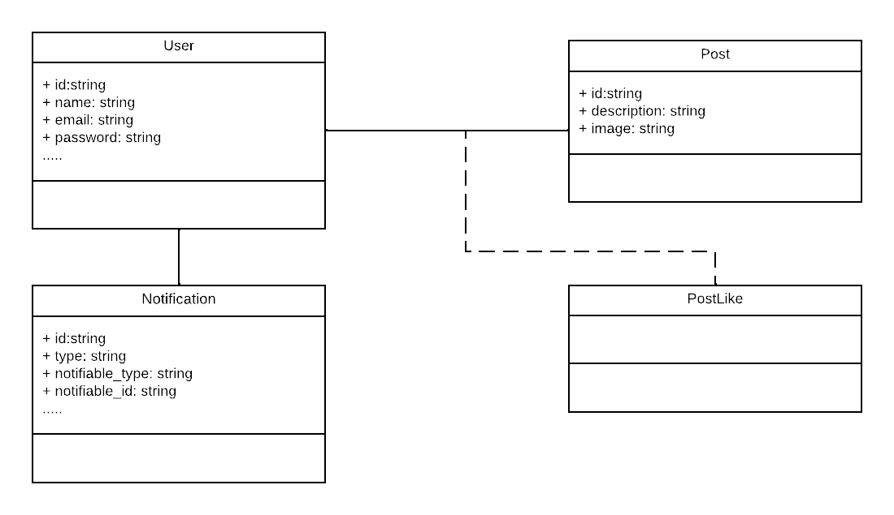
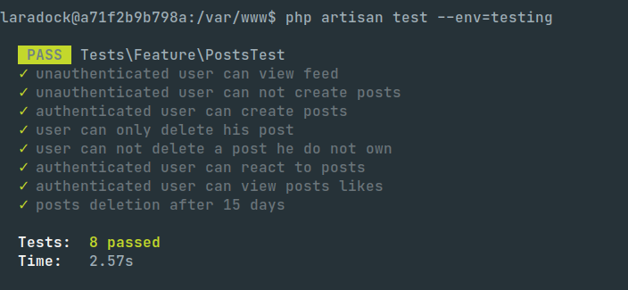
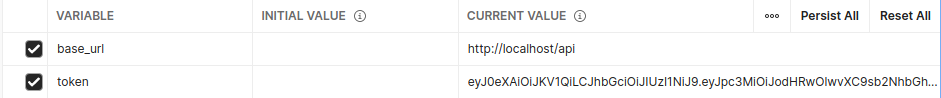

## Millions backend challenge
My implementation of Millions backend challenge.

## Database diagram


## Implemented features
* [x] Show posts in the feed with their information (Image, description, date, author) including
  total likes and the last 5 usernames who liked the post.
* [x] Feed is public (Doesn’t need authentication), paginated, and order by creation date.
* [x] Users should be authenticated to create or like/unlike posts.
* [x] Users can remove their posts, with the image file.
* [x] Users can like/unlike other posts.
* [x] Users can see all likes of a specific post.
* [x] Send a notification to other users when a new post is added. (Database channel).
* [x] Automatically delete posts 15 days old.

## Tests


## Used technologies

- Laravel 9
- PHP 8.0
- Mysql
- Docker

## Installation steps

* Clone repository
* `composer install`
* Create DB eg: `db_millions`
* `composer setup` (copies `env` file, generates key, and migrates DB)
* Then run ``` php artisan serve ```
* In order to test notifications, you need to setup redis locally then run ``` php artisan queue:work ```

## Postman collection

You can download this [postman collection](docs/postman_collection.json) to test the Api, modify these variables to simplify your testing journey.



